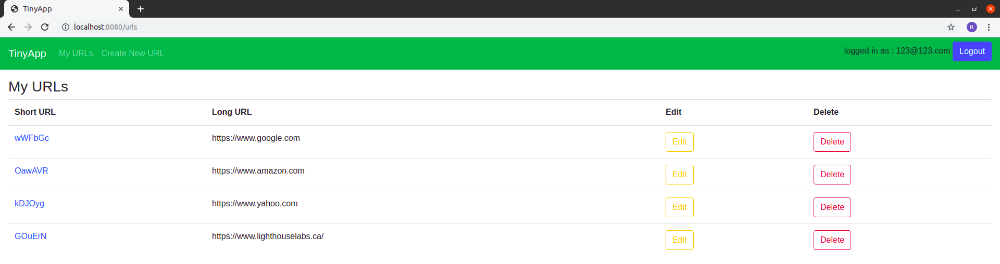
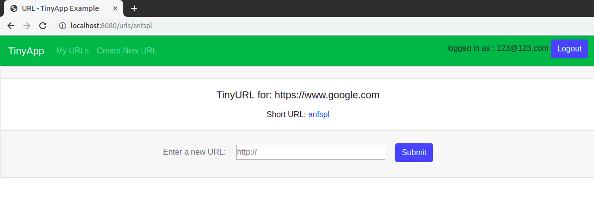

# TinyApp Project

TinyApp is a full stack web application built with Node and Express that allows users to shorten long URLs (à la bit.ly).

## Final Product




## Dependencies

```JS
  "dependencies": {
    "bcrypt": "2.0.0",
    "body-parser": "^1.19.0",
    "cookie-parser": "^1.4.4",
    "cookie-session": "^1.3.3",
    "ejs": "^2.6.2",
    "express": "^4.17.1"
  }
  ```
## Getting Started

- Install all dependencies (using the `npm install` command).
- Run the development web server using the `node express_server.js` command.